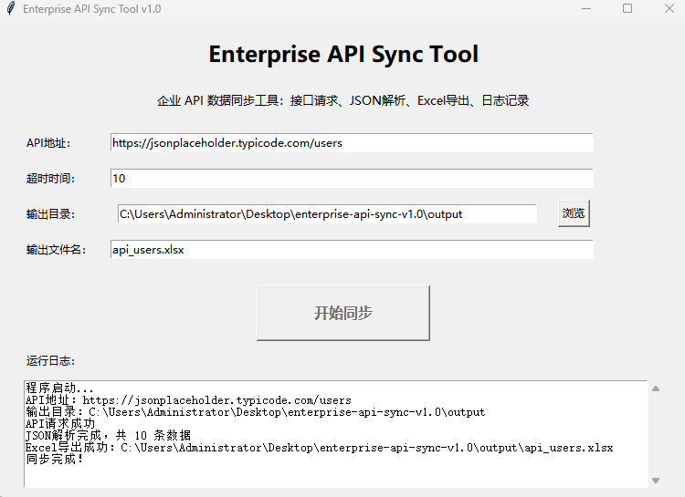
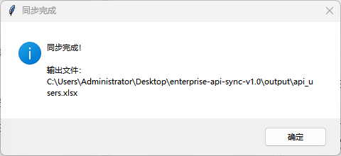
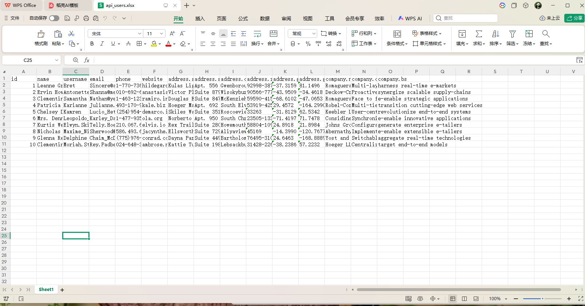

# 📡 Enterprise API Sync Tool

> 基于 Python 开发的企业 API 数据同步工具

一个模拟企业后台 API 数据同步系统，支持 HTTP 接口请求、JSON 数据解析、Excel 导出、日志记录，并提供桌面 GUI 操作界面，适用于企业接口开发、数据同步及自动化处理场景。

---

# ✨ 项目特色

- ✅ HTTP API 数据获取
- ✅ JSON 自动解析
- ✅ Excel 数据导出
- ✅ GUI 图形界面
- ✅ 接口请求日志
- ✅ 输出目录自由选择
- ✅ 超时参数配置
- ✅ 模块化设计
- ✅ 企业级项目结构

---

# 📷 软件预览

## 图形界面



---

## 同步完成



---

## 导出的 Excel



---

# 📂 工作流程

```text
HTTP API
      │
      ▼
Requests 请求数据
      │
      ▼
JSON 数据解析
      │
      ▼
字段整理
      │
      ▼
Excel 导出
      │
      ▼
生成运行日志
```

---

# 📁 项目结构

```text
enterprise-api-sync/

├── config/
│
├── docs/
│   ├── gui.png
│   ├── result.png
│   └── api_users.png
│
├── logs/
│
├── output/
│
├── src/
│   ├── api_client.py
│   ├── processor.py
│   ├── exporter.py
│   ├── logger.py
│   └── __init__.py
│
├── gui.py
├── main.py
├── requirements.txt
├── README.md
└── .gitignore
```

---

# 🔧 技术栈

| 技术 | 说明 |
|------|------|
| Python | 开发语言 |
| Requests | HTTP 请求 |
| JSON | 数据解析 |
| Pandas | 数据处理 |
| OpenPyXL | Excel 导出 |
| Tkinter | GUI 图形界面 |
| Logging | 日志记录 |

---

# 🚀 快速开始

## 1. 安装依赖

```bash
pip install -r requirements.txt
```

---

## 2. 启动 GUI

```bash
python gui.py
```

---

## 3. 命令行运行

```bash
python main.py
```

---

# 📋 默认接口

项目默认演示接口：

```
https://jsonplaceholder.typicode.com/users
```

返回 JSON 用户数据，并自动导出为 Excel。

---

# 💼 商业应用场景

本项目模拟企业系统之间的数据同步流程。

适用于：

- ERP 数据同步
- CRM 用户同步
- OA 系统接口
- 第三方开放平台
- 企业数据接口
- 自动化数据采集

典型流程：

```
HTTP API

↓

获取数据

↓

JSON解析

↓

数据整理

↓

Excel导出

↓

生成日志
```

---

# ⭐ 项目亮点

- 模块化架构
- GUI 桌面工具
- REST API 调用
- JSON 数据解析
- Excel 自动导出
- Requests 网络请求
- 日志记录
- 企业级目录结构
- Python 自动化开发

---

# 📈 项目成果

✔ 成功请求 REST API

✔ 自动解析 JSON 数据

✔ 自动导出 Excel

✔ 图形界面操作

✔ 输出运行日志

✔ 模块化代码设计

---

# 👨‍💻 作者

**Joy Wang**

GitHub：

https://github.com/wjoy00337-debug

---
